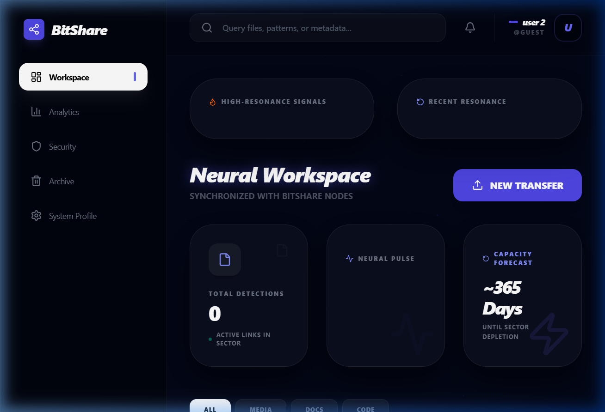

<div align="center">
  <h1>BitShare Enterprise SaaS</h1>
  <p>Premium, enterprise-grade file distribution and synchronization platform designed for high-fidelity data governance and real-time network intelligence.</p>
</div>



## Core Architectural Pillars

### 1. Neural Pulse Visualization (Hyper-Vibrant Analytics)
The "Neural Pulse" is the heart of the BitShare Dashboard. It provides a high-vibrancy, real-time activity stream of the network's data throughput.
- **Technology**: Built using `Recharts` and `Framer Motion` for smooth, procedural animations.
- **Visuals**: Uses neon glow filters (`#00f2fe` Aqua to `#4facfe` Electric Blue) with intensified Gaussian blurs to create a "liquid light" effect.
- **Intelligence**: Normalizes activity signals to ensure a baseline "pulse" is always visible, representing the living state of the enterprise storage sector.

### 2. Temporal Decimation (Premium Link Governance)
A sophisticated link expiration system that allows users to control the lifespan of their shared data.
- **Governance**: Tier-based enforcement. `FREE` users are restricted to permanent links, while `PRO` and `ENTERPRISE` users can access timed decay (1h, 1d, 7d).
- **Security**: Once the temporal threshold is reached, the download conduit is programmatically severed (returning 410 Gone), ensuring strict data hygiene.

### 3. Neural Notification Protocol
A real-time signal feed that tracks network interactions across the platform.
- **Socket Fusion**: Uses `Socket.io` for millisecond-latency notification propagation.
- **Interface**: A premium glassmorphism dropdown that alerts users to new uploads, downloads, and system events.

### 4. Storage Governance & Tiered Access
Strict enforcement of data quotas based on user subscription tiers.
- **Free Tier**: 100MB Capacity | Standard Distribution
- **Pro Tier**: 10GB Capacity | Temporal Decimation | Neural Intelligence
- **Enterprise**: Custom Capacity | Full Audit Logs | Dedicated Node

## Technical Stack
- **Frontend**: React (Vite), Tailwind CSS, Framer Motion, Recharts, Lucide React.
- **Backend**: Node.js (Express 5), MongoDB (Mongoose), Socket.io, JWT.
- **Payments**: Stripe (Tier-based storage unlock).
- **Storage**: Multi-node local buffer with encrypted path mapping.

## Setup Instructions

1. Clone the repository
2. Install dependencies for both frontend and backend
   ```bash
   cd backend && npm install
   cd ../frontend && npm install
   ```
3. Set up the `.env` file in backend with MongoDB URI, JWT Secret, Stripe Secret, and Firebase variables.
4. Run the development environments
   ```bash
   cd backend && npm start
   cd ../frontend && npm run dev
   ```

---
**Status**: Phase 7 (Neural Resonance) Operational.
