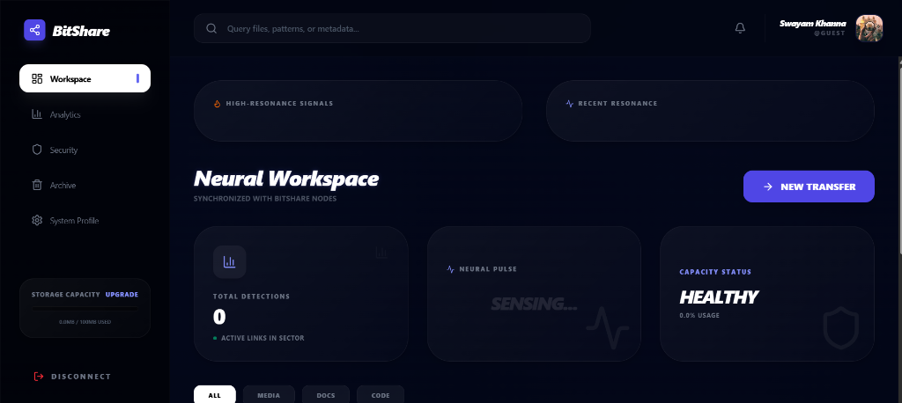

# BitShare 🧬 - Neural File Distribution



## Overview
**BitShare** is a next-generation, high-performance file distribution platform built on a neural-inspired architecture. It leverages real-time synchronization across distributed nodes to provide a seamless, secure, and hyper-efficient workspace for your digital assets.

## 🚀 Key Features

- **Neural Workspace**: A sophisticated, glassmorphic dashboard featuring real-time synchronization with BitShare nodes.
- **Neural Pulse Analytics**: Live "Sensing" technology to monitor file health, resonance signals, and distribution patterns.
- **Secure Neural Auth**: Enterprise-grade security with **Google OAuth** integration for seamless and safe access.
- **Real-Time Resonance**: Instant notifications and updates powered by **Pusher**, ensuring your workspace is always in sync.
- **Capacity Management**: Intelligent storage monitoring with automated capacity status detection (Healthy/Warning).
- **Quantum-Inspired Transfers**: High-resonance signal processing for ultra-fast "New Transfer" capabilities.

## 🛠 Tech Stack

### Frontend
- **React + TypeScript** (Vite-powered)
- **Tailwind CSS** (for the premium dark-mode aesthetic)
- **Zustand** (State Management)
- **Framer Motion** (Staggered Animations)
- **Pusher JS** (Real-time events)

### Backend
- **Node.js + Express**
- **MongoDB** (Distributed database)
- **Pusher Server** (Event broadcasting)
- **Google OAuth 2.0**
- **Helmet + CORS** (Security & Cross-Origin management)

## 📦 Installation

To deploy the BitShare neural mesh locally:

1. **Clone the repository:**
   ```bash
   git clone https://github.com/Swayam-Khanna/BitShare-Neural-File-Distribution.git
   cd BitShare-Neural-File-Distribution
   ```

2. **Frontend Setup:**
   ```bash
   cd frontend
   npm install
   npm run dev
   ```

3. **Backend Setup:**
   ```bash
   cd ../backend
   npm install
   npm start
   ```

## ⚙️ Environment Variables

Create `.env` files in both `frontend` and `backend` directories:

### Backend `.env`:
```
PORT=8000
MONGODB_URI=your_mongodb_uri
PUSHER_APP_ID=your_id
PUSHER_KEY=your_key
PUSHER_SECRET=your_secret
PUSHER_CLUSTER=your_cluster
GOOGLE_CLIENT_ID=your_google_id
GOOGLE_CLIENT_SECRET=your_google_secret
ALLOWED_ORIGINS=http://localhost:5173
```

### Frontend `.env`:
```
VITE_GOOGLE_CLIENT_ID=your_google_id
VITE_PUSHER_KEY=your_key
VITE_PUSHER_CLUSTER=your_cluster
```

## 📄 License
This project is licensed under the MIT License.

---
*Created with ❤️ by **Swayam Khanna***
